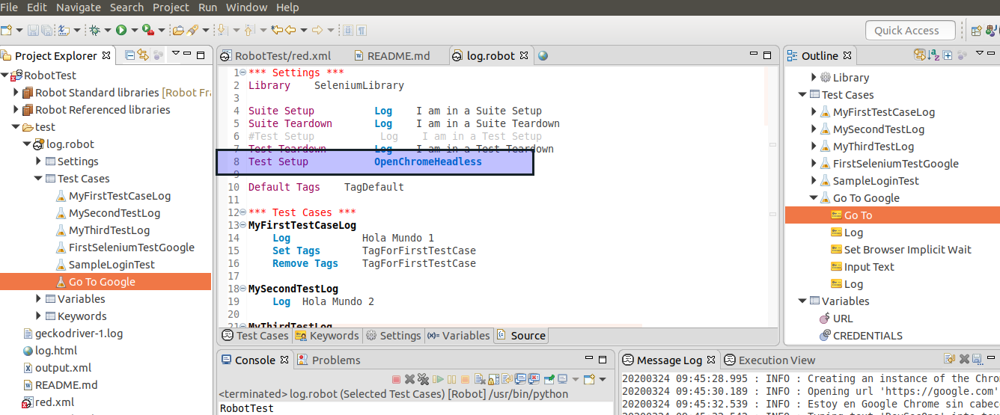
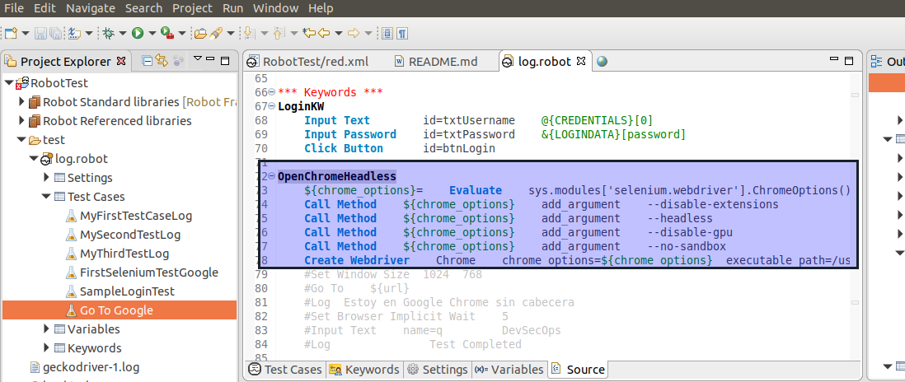
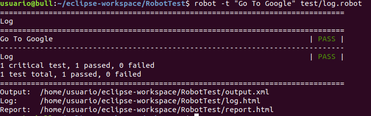
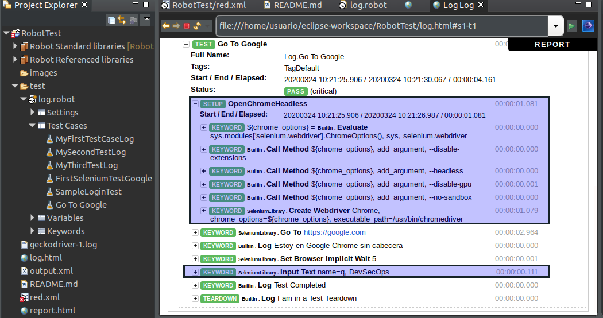

# Test Functional with Robot Framework
Proyecto de estudio y practica de robot framework (Pruebas funcionales)

## Para ejecutar por linea de comandos

En la ruta del proyecto

robot -t MyFirstTestCaseLog test/Log.robot

## Etiquetas 

robot -t --settag=tagname MyFirstTestCaseLog test/log.robot

robot --include smoke test/log.robot

robot -i sanity -i smoke test/log.robot

## COMMAND LINE

robot -t testname TestSuiteName

robot -t testname1 -t testname2 TestSuiteName

# La configuración del ChromeHeadlees se encuentra:

 # Test Setup

 
 
 # Chrome Options
 
 
 
 
 # Test Case "Go To Google"

 

 # Ejecución por linea de comandos (Se debe tener en cuenta la ruta en donde se descargue el proyecto)
 
 
 
 # Reporte Log (Tener en cuenta que se ejecutó con el setup de ChromeHeadlees)
 
 
 
 La configuracion del ChromeHeadless se hizo basado en la siguiente documentacion: [Documentación](https://gist.github.com/b4oshany/18b0b84524a5ba9c853fb179b522780b)
 
