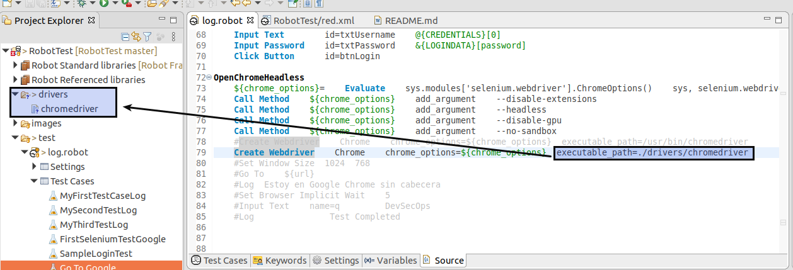

# Test Functional with Robot Framework
Proyecto de estudio y practica de robot framework (Pruebas funcionales)

Aprovisionamiento de Robot Framework

## 1. Instalar Python Segun la version de Robot framework a Utilizar

(En este caso se utilizará Python 2.7 y Robot FRamework 3.0)

En Windows se debe agregar el ejecutable de Python como variable de ambiente
En Linux debe estar en la ruta /usr/bin/

## 2. Instalar Pip 

## 3. Instalar Robot Framework desde Pip
 
 Instala la última versión de robotframework

    pip install robotframework
    
 Instalar una versión específica

    pip install robotframework==3.0
    
## Verificacion de la configuracion de Python y Robot Framwork

 
    
## 4. Chrome Driver

El proyecto esta configurado para ejecutarse bajo ChromeHeadlees y obtener el chrome driver en el siguiente setup (OpenChromeHeadless)

 
 
## 5. Test Cases

## 6 En ambiente Linux es posible que se necesite instalar Chrome Driver

Debido al siguiente error:

WebDriverException: Message: Service chromedriver unexpectedly exited. Status code was: 127

   sudo apt-get install -y chromium-browser
   
 Referencia: [Documentación](https://stackoverflow.com/questions/49323099/webdriverexception-message-service-chromedriver-unexpectedly-exited-status-co)

## Ejecución por linea de comandos

En la ruta del proyecto

 robot -t MyFirstTestCaseLog test/Log.robot

## Etiquetas 

robot -t --settag=tagname MyFirstTestCaseLog test/log.robot

robot --include smoke test/log.robot

robot -i sanity -i smoke test/log.robot

## COMMAND LINE

robot -t testname TestSuiteName

robot -t testname1 -t testname2 TestSuiteName

# La configuración del ChromeHeadlees se encuentra:

 # Test Setup

 
 
 # Chrome Options
 
 
 
 
 # Test Case "Go To Google"

 

 # Ejecución por linea de comandos (Se debe tener en cuenta la ruta en donde se descargue el proyecto)
 
 
 
 # Reporte Log (Tener en cuenta que se ejecutó con el setup de ChromeHeadlees)
 
 
 
 La configuracion del ChromeHeadless se hizo basado en la siguiente documentacion: [Documentación](https://gist.github.com/b4oshany/18b0b84524a5ba9c853fb179b522780b)
 
